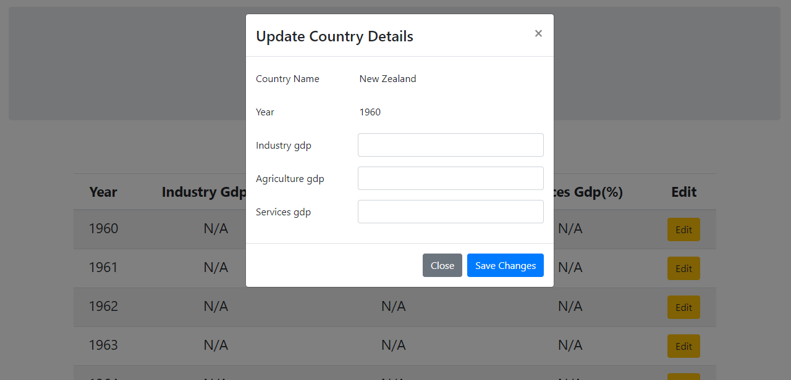

# Project Documentation

This project describes data visualisation of data of about 200 countries that were fetched from gapminder.org. Different types of country-specific data (population, GDP, industrial growth etc.) are shown in single page as multiple bar chart as yearly basis. Two versions of the same project were built using two different sets of technologies 
  

  1. Flask, MongoDB, and D3.js  
  2. Node.js and React.
  

## Stack1 - Flask

### Visualisation

## Stack2 - Node.js

### Visualisation

